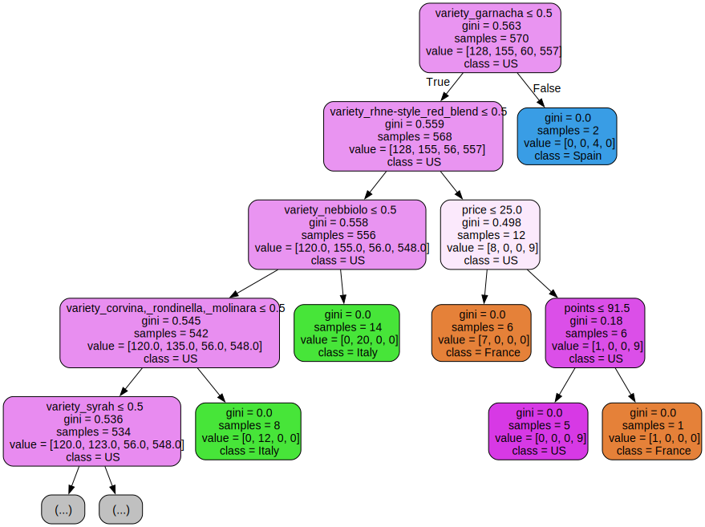

# Wine Origin Classifier: Predicting Country of Origin of Wines using ML and LLMs

**Name**: Alexander Shemaly

**Date**: 4rd December 2024

## Table of Contents
1. [Introduction](#1-introduction)
2. [Data Overview](#2-data-overview)
   1. [Data Imbalance](#21-data-imbalance)
   2. [Model Baseline](#22-model-baseline)
   3. [Wine Descriptions](#23-wine-descriptions)
3. [Approach and Methodology](#3-approach-and-methodology)
   1. [Predictive Modeling Using Quantitative Data](#31-predictive-modeling-using-quantitative-data)
   2. [NLP for Textual Feature Extraction](#32-nlp-for-textual-feature-extraction)
   3. [LLM Integration](#33-llm-integration)
4. [Conclusion](#4-conclusion)
   1. [4.1 Best Technique](#41-best-technique)
   2. [4.2 Thoughts on Results](#42-thoughts-on-results)
5. [Challenges and Next Steps](#5-challenges-and-next-steps)

## 1. Introduction

The purpose of this project was to build a classification model that predicts
the country of origin of wines based on a dataset containing wine reviews.

This report outlines the approach taken to preprocess the data, handle the challenges posed by imbalanced data and categorical features, and evaluate various models, including the  use of Large Language Models (LLMs).

## 2. Data Overview

The dataset includes five columns: **Country**, **Description**, **Points**, **Price**, and **Variety**:

- **Country**: The target variable, representing the country of origin of the wine. It can be one of four categories: **US**, **Spain**, **France**, or **Italy**.
- **Description**: A plain-text description of the wine, typically containing 30-40 words. This field provides details about the wine's characteristics, flavors, and other sensory attributes.
- **Points**: An integer value representing the average review score of the wine on a scale of 1-100.
- **Price**: An integer value indicating the cost of a bottle of wine.
- **Variety**: A string representing the type of grape used to make the wine. This is a categorical feature with several possible values.

### 2.1 Data Imbalance

Upon examining the distribution of the target variable, **Country**, it is clear that the dataset is highly imbalanced, as shown below:

- **US**: 622 entries
- **Italy**: 174 entries
- **France**: 133 entries
- **Spain**: 71 entries

This indicates that the model will be more likely to predict the **US** correctly simply due to its higher representation. The imbalance in the dataset poses a challenge for the underrepresented classes, particularly **Spain**, **France**, and **Italy**, which may be under-predicted by the model.

To account for this imbalance, we will use weighted evaluation metrics, such as the weighted average F1-score, which considers the proportion of each class in the dataset. This will help ensure that the model's performance on the less frequent classes is properly reflected.

### 2.2 Model Baseline

With four possible countries to predict, a model that predicts randomly would have an expected accuracy of 25%.

However, since the **US** is the most frequent class (by a significant margin), a model that always predicts **US** would have an accuracy of approximately 62%. This reflects the imbalance in the dataset and highlights the risk of overfitting to the majority class, where **US** is predicted most of the time.

Given this, a baseline accuracy of **62%** is a reasonable benchmark. The model we develop should aim to exceed this baseline by improving its predictions for the underrepresented classes, particularly **Spain**, **France**, and **Italy**.

### 2.3 Wine Descriptions

The **Description** column in the dataset provides detailed insights into the sensory attributes of each wine. These attributes can offer valuable clues for predicting the **Country** of origin, as different regions tend to produce wines with distinct profiles.

The following wine features could help identify the country of origin of the wine:

- **Flavor Profiles**: Terms like *berry*, *pepper*, and *mushroom* indicate fruity, spicy, or earthy characteristics, suggesting the wine's flavor profile.

- **Texture and Body**: Descriptors such as *light-bodied*, *full-bodied*, and *tannic* reveal the wine's weight and texture.

- **Acidity and Sweetness**: Words like *high acidity* and *dry* convey the wine's freshness and sugar content.

- **Aging and Ageability**: Phrases like *ready to drink* or *needs aging* describe the wine's maturity and aging potential.

- **Terroir and Region**: Terms such as *coastal* or *volcanic* point to the influence of the wine's origin and terroir.

By analysing these features, we can identify patterns that might correlate with specific countries of origin. For example, **earthy** and **floral** flavors may point to **France** or **Italy**, while **fruity** and **spicy** notes could suggest wines from the **US** or **Spain**.

These features can be extracted using the **Large Language Model (LLM)** techniques to enhance the model and improve prediction accuracy.

## 3. Approach and Methodology

To predict the **country of origin** of wine, I will combine machine learning and natural language processing (NLP) techniques.

For the first part, I will begin by creating a baseline model using only the existing features in the dataset, such as **Points**, **Price**, and **Variety**, while ignoring the **description** field. This will help me establish a starting point and assess the contribution of these features to the prediction of the **country**.

For the second part, I will enhance the model by applying **NLP techniques** to the **description** field. This will include methods like **bag-of-words** and **TF-IDF vectorisation**, which will allow the model to capture important textual features. 

Finally, I will integrate **Large Language Models (LLM)** to extract relevant features and guide the text vectorisation process, enhancing model performance by reducing noise and focusing on contextually important features.

### 3.1 Predictive Modeling Using Quantitative Data

In this phase, I will build a predictive model using the existing quantitative features: **Points**, **Price**, and **Variety**. This will establish a baseline model to predict the **country of origin** of the wine and assess what can be achieved with the current data.

- **Points**: While representing the wine's average review score, this feature may not strongly predict the country of origin, as wines from different regions can receive similar ratings.
- **Price**: Although it provides insight into the wine's cost, price can vary widely across regions and may not effectively differentiate between countries.
- **Variety**: This feature is likely to be a strong predictor, as certain grape varieties are strongly associated with specific regions. However, with 105 categories, **one-hot encoding** will be used to transform **Variety** into binary columns.

#### 3.1 Choice of Model

For modeling, I will use a **Random Forest**, an ensemble method that combines multiple **decision trees** to improve accuracy. Each tree is trained on a random subset of data and features. A **decision tree** splits data based on a feature that provides the best **information gain**, which helps classify the data, in this case, the wine's country of origin. While a single decision tree can overfit the data, **Random Forest** reduces this by averaging predictions from many trees, making it more robust and accurate.

Although a **neural network** could also be used, it may overtrain the data, especially with the current feature set. Neural networks are powerful but can become too complex for this task, requiring more training time and computational resources. In contrast, Random Forest provides a simpler and more interpretable solution. The decision trees produced by Random Forest are valuable for understanding the logic behind predictions, which is particularly useful in a business context.

#### 3.2 Initial Implementation

The implementation of the Random Forest model involved several key steps:

1. **Data Preprocessing**  
   The dataset required preprocessing to prepare it for modeling. I applied **one-hot encoding** to the categorical feature `variety` using `pandas`' `get_dummies()` function. This transformed the `variety` column into binary columns, enabling the model to process this categorical data effectively.

2. **Data Splitting**  
   The dataset was randomly split into **training** (90%) and **testing** (10%) sets to evaluate the model's performance. This ensured that the model was trained on a substantial portion of the data while reserving a smaller portion for unbiased performance evaluation.

3. **Model Implementation**  
   I implemented the Random Forest model using `RandomForestClassifier()` from the `sklearn` library. This library provides a robust and optimised implementation of Random Forest, saving time and effort compared to creating the model manually. The library's implementation also includes efficient methods for training, prediction, and feature importance analysis, making it the preferred choice for this task.

4. **Model Analysis and Interpretation**  
   To better understand how the Random Forest makes predictions, I visualised one of the decision trees within the forest. This provided insights into how individual features, such as `price` and `points`, influenced the classification process and demonstrated the interpretability of the model. 

#### 3.2 Results

The model's performance is summarised using a confusion matrix, providing a detailed breakdown of correct and incorrect predictions for each class:

- **Accuracy**: 64%  
- **Weighted F1-Score**: 57%

| **Actual / Predicted** | **France** | **Italy** | **Spain** | **US** |
|-------------------------|------------|-----------|-----------|--------|
| **France**             | 4          | 0         | 0         | 11     |
| **Italy**              | 0          | 3         | 0         | 15     |
| **Spain**              | 0          | 0         | 0         | 6      |
| **US**                 | 0          | 2         | 2         | 57     |

From the confusion matrix, it is evident that the model struggles to predict certain countries like **Spain**, while it performs better for the **US**, likely due to the class imbalance in the dataset, with the US being the dominant class.

#### Decision Tree Analysis

To better understand the Random Forest model, we can take a look at one of the decision trees. 

Taking a look at the top, we can see than we split on the **garnacha** variety: If it belongs to it, we deduce that it is from **Spain**. Otherwise, we continue.

Further down the tree, splits are made using other features, such as **price** and **points**. 

#### 3.3 Improvement using Hyperparameter Tuning with Cross-Validation

To further improve the model's performance, I employed hyperparameter tuning to identify the optimal values for the model's parameters. The hyperparameters were `n_estimators` (the number of trees in the forest) and `max_depth` (the maximum depth of the trees) which are crucial in determining the model's ability to generalise and avoid overfitting.

To perform this tuning, I first split the training data into training and validation sets. I used `GridSearchCV()` from `sklearn.model_selection`, which performs an exhaustive search over a specified parameter grid. It evaluates all combinations of hyperparameters and selects the ones that yield the best performance based on cross-validation. 

The parameter grid I used for tuning was as follows:
- **n_estimators**: [100, 200, 300, 500, 700]
- **max_depth**: [10, 20, 30, 40, 50]

#### 3.4 Results

Here is a summary of the performance of the model:

The best hyperparameters found were:

- **max_depth**: 40
- **n_estimators**: 700

With these hyperparameters, the model achieved the following results:

- **Accuracy**: 71%
- **Weighted F1-Score**: 70%

| **Actual / Predicted** | **France** | **Italy** | **Spain** | **US** |
|------------------------|------------|-----------|-----------|--------|
| **France**             | 6          | 0         | 0         | 9      |
| **Italy**              | 1          | 10        | 0         | 7      |
| **Spain**              | 0          | 1         | 4         | 1      |
| **US**                 | 2          | 6         | 2         | 51     |

We can say that the model significantly improved with hyperparameter tuning. The increase in **accuracy** from 64% to 71% and the jump in the **weighted F1-score** from 57% to 70% demonstrate that adjusting the model's parameters allowed it to better capture the complexities in the data. 

#### 3.5 Summary

The model using only the quantitative features **Points**, **Price**, and **Variety** achieved an **accuracy** of 71% and a **weighted F1-score** of 70%. This is better than the baseline, but not by much. While **Variety** was a strong predictor, the model struggled with countries like **Spain**, likely due to class imbalance, with **US** being overrepresented. 

Despite this, the results highlight the limitations of relying solely on three pieces of quantitative data for predicting the **country of origin**. Moving forward, incorporating **NLP** techniques could allow the model to leverage additional information from textual data provided by **Description**, potentially improving predictions further.

### 3.2 NLP for Textual Feature Extraction

The **description** column contains valuable information that can improve our model's performance. To integrate this into the model, I will apply text processing techniques such as **Bag of Words** and **TF-IDF Vectorisation**.

These methods will convert the textual data into numerical features. I will also filter out stop words—common but uninformative words—and explore **Sentiment Analysis** to capture the tone of the text, potentially adding further predictive power to the model.

#### 3.2.1 Bag of Words

The Bag of Words (BoW) model is a simple yet effective technique used for feature extraction in natural language processing. It converts a collection of text into a matrix of token counts, where each row represents a document, and each column represents a word in the vocabulary. The values in the matrix are the counts of how many times a word appears in a document.

To implement BoW, I used the `CountVectorizer` from `sklearn.feature_extraction.text`. This method created a large number of columns, each corresponding to a unique word in the dataset. To avoid an excessively large feature space and improve computational efficiency, I restricted the vocabulary size to the top 500 most frequent words.

After running the model with this approach, I obtained the following results:
- **Test Accuracy**: 74%
- **Weighted F1-Score**: 67%

This marked a slight improvement over the initial model, indicating that incorporating text features could be useful, but there was still room for improvement.

Since the model was incorporating a lot of common, less informative words (such as "the", "and", etc.), I decided to remove these stop words. The `CountVectorizer` has a built-in argument called `stop_words`, which allows us to exclude these frequently occurring words from the vocabulary.

After applying this adjustment and retraining the model, the results improved significantly:
- **Test Accuracy**: 78%
- **Weighted F1-Score**: 74%

This was a major improvement, highlighting the importance of removing unnecessary words and refining the feature space. The increase in accuracy and F1-score suggests that focusing on the most meaningful words helped the model better capture the relevant patterns in the data.

After looking at the top words from the produced by BoW column, the most commonly used words were:

| Word   | Frequency |
|--------|-----------|
| wine   | 598       |
| flavors| 525       |
| fruit  | 395       |
| cherry | 240       |
| tannins| 224       |

#### Thoughts

These words highlight the general characteristics of the wine, such as its flavors and sensory qualities. While terms like "wine" and "fruit" are expected, they are quite vague and could apply to many wines. More specific, region-related terms would be helpful for distinguishing wines more effectively. I could use the LLM in combination to reduce these broad terms to more context-specific keywords that better capture the wine's origin and unique features.

#### 3.2.2 TF-IDF Vectorisation

Next, I experimented with a different text feature extraction technique called TF-IDF (Term Frequency-Inverse Document Frequency) Vectorisation. TF-IDF adjusts the importance of words based on how frequently they appear in a document (term frequency) and how rare they are across the entire dataset (inverse document frequency). This helps down-weight common words that are less informative and emphasise more unique words.

I implemented TF-IDF using `TfidfVectorizer` from `sklearn.feature_extraction.text`. Just as with the Bag of Words model, I also removed stop words during this step to ensure that common, non-informative words didn't negatively impact the model's performance.

After training the model, I obtained the following results:
- **Test Accuracy**: 78%
- **Weighted F1-Score**: 75%

This represents a slight improvement over the Bag of Words approach, showing that TF-IDF provides a better way of capturing the relative importance of words, making the model more sensitive to key features in the text.

#### 3.2.3 Sentiment Analysis

Finally, I explored the use of Sentiment Analysis to capture the emotional tone of the wine descriptions. Sentiment analysis works by determining the overall sentiment expressed in a piece of text, typically ranging from positive to negative. For implementation, I used the `TextBlob` library, which provides two key sentiment attributes:
- **Polarity**: Ranges from -1 (negative) to 1 (positive), indicating the emotional sentiment of the text.
- **Subjectivity**: Ranges from 0 (objective) to 1 (subjective), indicating how subjective or opinionated the text is.

I ran the Sentiment Analysis in combination with TF-IDF Vectorisation and got the following results:
- **Test Accuracy**: 78%
- **Weighted F1-Score**: 75%

Interestingly, the results were exactly the same as the TF-IDF Vectorisation alone. This suggests that sentiment analysis might not provide much additional value for this particular dataset.

Upon further inspection, I noticed that most sentiment values were close to 0, indicating that the text was largely neutral. For example, the description *"From a site near Annapolis, this wine shows a preponderance of dark grape and cherry flavor interwoven with cinnamon and black peppercorn..."* received a sentiment score of approximately **-0.1**, which is slightly negative. I do not think that adds much value to the model's predictive power.

This suggests that sentiment analysis may not be a particularly useful feature for predicting wine origin in this case, as it doesn't seem to correlate well with the outcome. The subjective nature of wine descriptions may lead to inconsistent sentiment scores that don't add significant predictive power to the model.

### 3.3 LLM Integration

Integrating NLP into the model has shown promise in improving performance by leveraging the wine descriptions. These descriptions provide valuable insights into the wine's properties, which can enhance the model's ability to predict its origin.

Large Language Models (LLMs) are powerful tools, as they are trained on vast amounts of knowledge and can generate context-rich insights. However, calling an LLM is expensive and time-consuming, making it less practical to use repeatedly on large datasets.

To mitigate this, I saved the LLM's responses to a CSV file after each call, ensuring that I did not re-run the LLM for the same wine description. Writing to the CSV file also allows for saved data, providing protection in case the program crashes, ensuring that previous responses are not lost.

I will explore three approaches to incorporate the LLM:
1. **Baseline Model**: Ask the LLM to predict the wine's origin based on the description and details alone, without using the local model.
2. **LLM-guided Text Vectorisation**: Use the LLM to reduce the features to the most relevant ones for predicting the wine's origin.
3. **Feature Extraction**: Extract additional features from the LLM (such as missing attributes) and feed them into the Random Forest model for improved predictions.

#### 3.3.1 LLM-Only Predictions

Given that the LLM model is based on GPT, I hypothesised that it might offer valuable insights into predicting the wine's country of origin. I provided it with all available details—Description, Points, and Price—and asked it to predict which of the four countries the wine was most likely from.

To implement this, I created a new class called `LLMClassifier.py`, which allowed me to query the model directly for predictions without requiring any prior training. The model was asked to predict the country of origin for each wine using the following prompt:

**Prompt to the LLM**:  
"Predict the country of origin for this wine:  
- **Description**: '[Wine Description]'  
- **Price**: [Wine Price], **Rating**: [Wine Points]/100, **Variety**: '[Wine Variety]'.  
- **Possible countries**: [France, Italy, Spain, US].  
- Respond with the country's name as a single word."

I ran this model on the entire dataset of 1000 wines, making this experiment the one with the largest test set. The results were:

- **Overall Accuracy**: 72.8% (728/1000 correct)
- **Weighted F1-Score**: 75%

**Per-Country Accuracy**:

| Actual Country | Accuracy    |
|----------------|-------------|
| France         | 88.72%      |
| Italy          | 83.91%      |
| Spain          | 88.73%      |
| US             | 64.47%      |

The LLM performed reasonably well, yielding better results than the baseline model. However, it did not outperform TF-IDF Vectorisation (which achieved 78% accuracy). 

One possible explanation for this is that the LLM was only given the wine's description, points, and price, without utilising other features or any training. In contrast, TF-IDF Vectorisation incorporated the entire dataset and was trained specifically for the task, which likely provided an advantage in feature extraction and prediction accuracy.

So far, it seems that the time and cost associated with using the LLM do not justify the performance gains in this case.

#### 3.3.2 LLM-guided Text Vectorisation

TF-IDF Vectorisation had been the most effective technique so far, achieving solid results. To improve the model further, I sought to ensure the words used were more relevant to the context of wine. Since TF-IDF worked best with around **500** selected words (columns), I decided to incorporate LLM-guided filtering to focus on wine-related features.

To achieve this, I used the LLM to identify and extract relevant words for each wine description. These words were saved in a file called `wine_features_1000.csv`. Once the words were filtered, I applied TF-IDF vectorisation on the cleaned dataset.

Initially, I tested this approach on a subset of 10 wines. Compared to the original method, LLM filtering reduced the features from **180** to just **108**. 

After performing the process on the entire dataset, the model produced the following results:

- **Test Accuracy**: 80%
- **Weighted F1-Score**: 77%

| **Actual / Predicted** | **France** | **Italy** | **Spain** | **US** |
|------------------------|------------|-----------|-----------|--------|
| **France**             | 6          | 0         | 0         | 9      |
| **Italy**              | 0          | 13        | 0         | 5      |
| **Spain**              | 0          | 1         | 1         | 4      |
| **US**                 | 0          | 0         | 1         | 60     |

This approach yielded a slight improvement over the baseline TF-IDF Vectorisation (which had an accuracy of 78%), but it took significantly longer to run.

Here are some of the most common words extracted:

| **Relevant Words**     |
|------------------------|
| **'fruit', 'cherry', 'dry', 'oak', 'black', 'sweet'** |

By leveraging the LLM, the extracted words were more relevant to the context of wine, which likely contributed to the model's improved performance. However, the added time cost may limit its practical use for larger datasets.

#### 3.3.3 Using LLM for Feature Extraction

Instead of adding a large number of columns representing the top 500 most used words, I aimed to extract more meaningful features that could help predict the origin of the wine. To achieve this, I utilised a Large Language Model (LLM) to read the wine descriptions and identify relevant details that could be useful for classification.

After conducting some research into the wine industry and examining the descriptions provided in the dataset, I came up with 24 features that might be valuable for the model. Here are some of these features (you can find the complete list and the code in `LLMFeatureExtractor.py`):

- **Fruity Flavor**: ["berry", "citrus", "apple", "peach", "plum", "tropical fruit"]
- **Spicy Flavor**: ["pepper", "cinnamon", "nutmeg", "clove"]
- **Earthy Flavor**: ["mushroom", "forest floor", "truffle", "soil", "leather"]
- **Body (Weight/Texture)**: ["light-bodied", "medium-bodied", "full-bodied", "creamy", "silky", "tannic"]
- **Acidity**: ["high acidity", "medium acidity", "low acidity", "crisp", "zesty"]
- **Sweetness Level**: ["bone dry", "dry", "off-dry", "sweet", "very sweet"]
- **Food Pairing**: ["barbecue", "cheese", "dessert]
- **Region/Terroir**: ["mineral", "volcanic", "coastal", "mountain"]
- **Color**: ["pale", "deep", "ruby", "garnet", "golden", "straw", "amber"]
- **Style**: ["traditional", "modern", "natural", "organic", "biodynamic"]

I implemented these features using a new class in `LLMFeatureExtractor.py`. This class analysed each wine description and extracted the presence of the listed features. It then appended the extracted features to the CSV file, ensuring robustness by saving the results incrementally. For efficiency, I only ran the extraction for 500 entries, as the process took considerable time.

#### Output

The extracted feature data (simplified here for readability) looks something like this:

<table style="font-size: 10px; border-collapse: collapse;">
  <thead>
    <tr>
      <th style="padding: 3px;">id</th>
      <th style="padding: 3px;">country</th>
      <th style="padding: 3px;">description</th>
      <th style="padding: 3px;">Fruity Favour</th>
      <th style="padding: 3px;">Spicy Favour</th>
      <th style="padding: 3px;">Earthy Favour</th>
      <th style="padding: 3px;">Body (Weight/Texture)</th>
      <th style="padding: 3px;">Acidity</th>
      <th style="padding: 3px;">Sweetness Level</th>
      <th style="padding: 3px;">Ageability</th>
      <th style="padding: 3px;">Food Pairing / Occasions</th>
      <th style="padding: 3px;">Region/Terroir</th>
      <th style="padding: 3px;">Style</th>
    </tr>
  </thead>
  <tbody>
    <tr>
      <td style="padding: 3px;">31920</td>
      <td style="padding: 3px;">US</td>
      <td style="padding: 3px;">From a dry-farmed...</td>
      <td style="padding: 3px;">berry</td>
      <td style="padding: 3px;">pepper</td>
      <td style="padding: 3px;">leather</td>
      <td style="padding: 3px;">tannic</td>
      <td style="padding: 3px;"></td>
      <td style="padding: 3px;">dry</td>
      <td style="padding: 3px;">needs aging</td>
      <td style="padding: 3px;">dinner</td>
      <td style="padding: 3px;"></td>
      <td style="padding: 3px;">natural</td>
    </tr>
    <tr>
      <td style="padding: 3px;">6091</td>
      <td style="padding: 3px;">US</td>
      <td style="padding: 3px;">From a site near...</td>
      <td style="padding: 3px;"></td>
      <td style="padding: 3px;">cinnamon</td>
      <td style="padding: 3px;">leather</td>
      <td style="padding: 3px;">light-bodied</td>
      <td style="padding: 3px;"></td>
      <td style="padding: 3px;"></td>
      <td style="padding: 3px;">needs aging</td>
      <td style="padding: 3px;">dinner</td>
      <td style="padding: 3px;">coastal</td>
      <td style="padding: 3px;">traditional</td>
    </tr>
    <tr>
      <td style="padding: 3px;">61984</td>
      <td style="padding: 3px;">US</td>
      <td style="padding: 3px;">There's a lot…</td>
      <td style="padding: 3px;">peach</td>
      <td style="padding: 3px;">pepper</td>
      <td style="padding: 3px;"></td>
      <td style="padding: 3px;"></td>
      <td style="padding: 3px;">zesty</td>
      <td style="padding: 3px;">dry</td>
      <td style="padding: 3px;">ready to drink</td>
      <td style="padding: 3px;">seafood pairing</td>
      <td style="padding: 3px;"></td>
      <td style="padding: 3px;"></td>
    </tr>
  </tbody>
</table>

#### Random Forest Results (Initial Run)

After extracting the features, I ran the Random Forest model with the new feature set, but the results were disappointing:

- **Test Accuracy**: 56%
- **Weighted F1 Score**: 47%

| **Actual / Predicted** | **France** | **Italy** | **Spain** | **US** |
|------------------------|------------|-----------|-----------|--------|
| **France**             | 0          | 0         | 0         | 7      |
| **Italy**              | 0          | 1         | 0         | 6      |
| **Spain**              | 0          | 1         | 0         | 4      |
| **US**                 | 1          | 3         | 0         | 27     |

These results were below the baseline, which is concerning. Upon closer examination, I realised that the model might have struggled with the missing values in the dataset.

#### Data Preprocessing Adjustments

To address the missing values, I decided to fill them in with appropriate values:
- For the `type_flavour` feature, I replaced missing values with `not_type` (indicating the absence of that specific flavour type).
- For the other features, I filled missing values using the mode (most common value).

#### Results After Data Preprocessing

After replacing missing values and retraining the model, the results improved significantly:

- **Test Accuracy**: 66%
- **Weighted F1 Score**: 59%

| **Actual / Predicted** | **France** | **Italy** | **Spain** | **US** |
|------------------------|------------|-----------|-----------|--------|
| **France**             | 1          | 0         | 0         | 6      |
| **Italy**              | 0          | 3         | 0         | 4      |
| **Spain**              | 0          | 1         | 0         | 4      |
| **US**                 | 1          | 1         | 0         | 29     |

These results were more realistic but still not impressive. The model performed slightly better than before, but the performance still fell short compared to the baseline (62%) and even worse than the model without the feature extraction (71%).

#### Model Evaluation with Reintroduced Features

After reviewing the output CSV file, I realised a significant oversight: I had accidentally omitted the columns for **points**, **price**, and **variety**. Although this gave us the chance to test the model based solely on the feature extraction from the description, it was crucial to reintroduce these columns for a more comprehensive evaluation. After fixing this, I retrained the model, and the results improved significantly:

- **Accuracy**: 72%  
- **Weighted F1-score**: 67%

| **Actual / Predicted** | **France** | **Italy** | **Spain** | **US** |
|------------------------|------------|-----------|-----------|--------|
| **France**             | 2          | 0         | 0         | 5      |
| **Italy**              | 0          | 3         | 0         | 4      |
| **Spain**              | 0          | 0         | 1         | 4      |
| **US**                 | 0          | 1         | 0         | 30     |

These new results are an improvement over the previous ones, though they still fall short of expectations. The model's performance is better than before, but it's still not significantly above baseline.

#### Thoughts

The model's performance was affected by missing values, but after addressing this, the improvements were modest. The feature extraction from wine descriptions using the LLM didn't provide as much value as anticipated. The features selected might not fully capture the relevant patterns for predicting wine origin, or they may not have strong correlations with the target variable. 

Additionally, Random Forest might not be the best model for this task. Exploring more complex models, such as neural networks, could offer better results. Further hyperparameter tuning of the Random Forest could also help optimise performance. Finally, evaluating the feature importance might shed light on which features are genuinely contributing to the classification, helping refine the feature extraction process moving forward.

### 4. Conclusion

In this experiment, we explored a range of techniques to enhance the wine origin classifier's performance by leveraging additional features and NLP-based approaches.

The **grape variety** emerged as the most influential single feature, yielding an accuracy of **71%** after applying hyperparameter tuning and cross-validation. Building on this, we incorporated NLP techniques like Bag of Words and TF-IDF, which demonstrated that focusing on relevant words in the wine descriptions significantly improved the model. Removing stop words boosted performance from **74%** to **78%**, and leveraging an LLM to filter key terms further increased accuracy to **80%**. Sentiment analysis, however, showed minimal impact.

We also experimented with **LLM-only predictions**, achieving **72.8%** accuracy without any reliance on other dataset features. While respectable, this was lower than the combined approaches. Lastly, using the LLM for **feature extraction** to identify domain-specific attributes resulted in a model accuracy of **66%** (without points, price, and variety) and **72%** when combined with all features, indicating limited incremental benefit from these features.

### 4.1 Best Technique

The best-performing method, achieving **80% accuracy** on a test set of 100 wines, was:

1. Extracting the most relevant words from descriptions using the LLM's judgment.  
2. Reducing the dimensionality by selecting the **top 500 most frequent terms** and applying TF-IDF.  
3. Combining this data with existing features like points, price, and variety.  
4. Training a Random Forest classifier with hyperparameter tuning and cross-validation.

### 4.2 Thoughts on Results

The wine descriptions proved to be a surprisingly rich source of information for classification. Current NLP techniques are highly effective, and integrating LLMs added value, particularly for filtering and feature selection. However, the LLM-based feature extraction process fell short of expectations in terms of model performance relative to the time investment required for querying.

While the final model performed well, I believe its **80% accuracy** may be inflated by the dataset's imbalance favoring US wines. This imbalance could mean the model performs worse on non-US wines. Despite this, I am satisfied with the results and the insights gained from exploring both traditional NLP methods and the capabilities of LLMs.

## 5. Challenges and Next Steps

1. **Data Imbalance**:  
   The dataset is skewed towards wines from certain countries, particularly the U.S., which negatively impacted the model's ability to generalise to wines from underrepresented countries. This imbalance led to lower performance for the model when predicting wines from non-U.S. origins. A potential solution is to acquire a more balanced dataset or apply data augmentation techniques, such as oversampling or undersampling, to ensure a more even distribution across the wine origins.

2. **LLM Query Time**:  
   A major bottleneck in the process was the time spent querying the LLM for each row of the dataset. With larger datasets, this could become even more prohibitive, as the LLM was called multiple times per row. A solution could involve batch processing, reducing redundant queries, or caching previously queried results to speed up the process.

3. **Excessive and Irrelevant Features**:  
   The LLM model included words like “wine” and “acidity” in the feature set, which as they are related to the general context of wine (which is what I asked) but do not provide valuable insights about the wine’s origin. Implementing harsher filtering techniques and better LLM prompts before applying models like TF-IDF could help remove such terms and focus the model on more meaningful, context-specific words that contribute to distinguishing the wine's origin.

4. **Model Limitations with Static Data**:  
   Using a static model, like `gpt-4o-mini` for wine origin prediction, which lacks the ability to update dynamically, limits the potential for incorporating real-time data. For example, if a model could connect to the internet and access up-to-date information on wine regions or wineries, once it sees a name in the wine description. A future direction could involve building a model capable of querying real-time resources (e.g., web scraping or integrating APIs) to gain contextual insights like country-specific information or recent wine industry trends.
